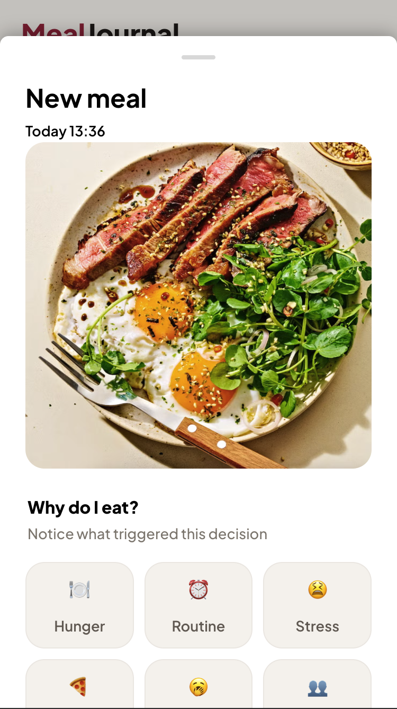
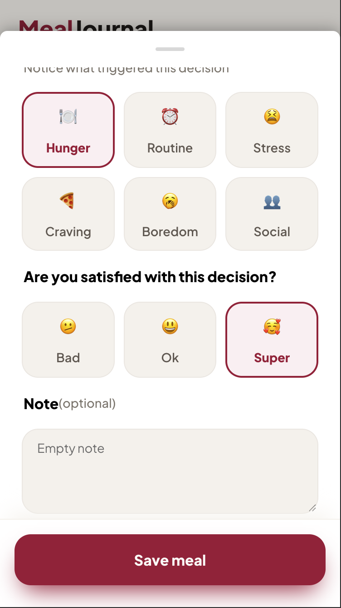
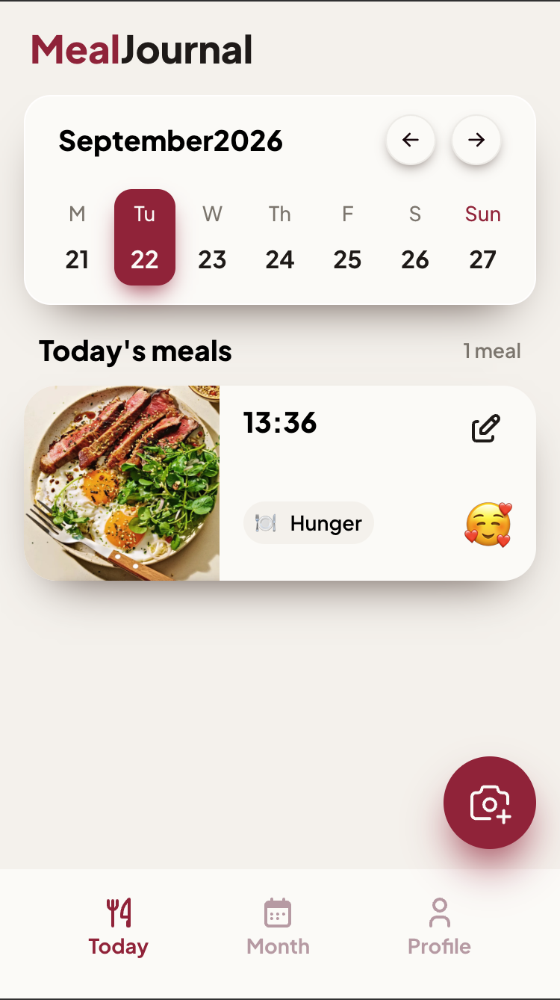
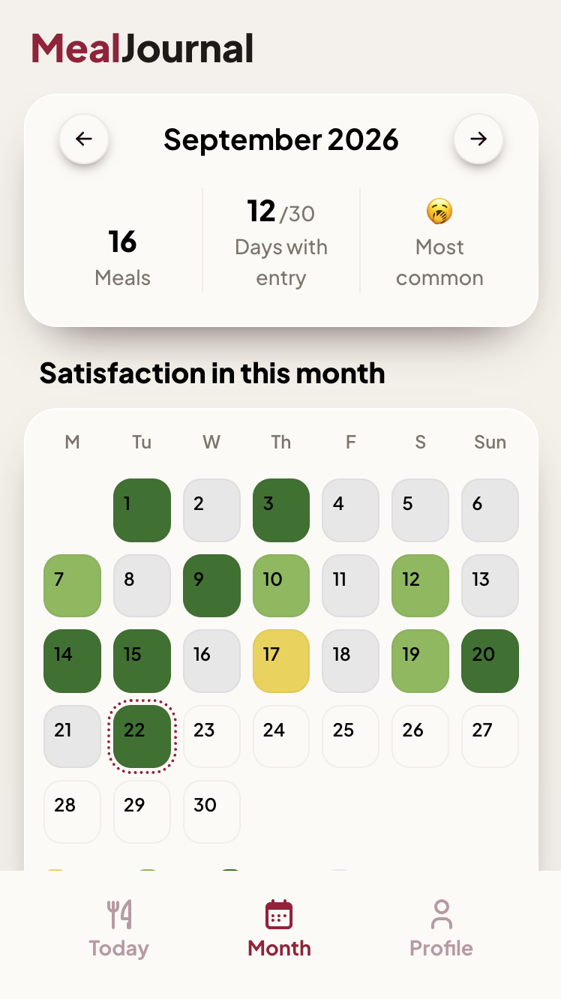
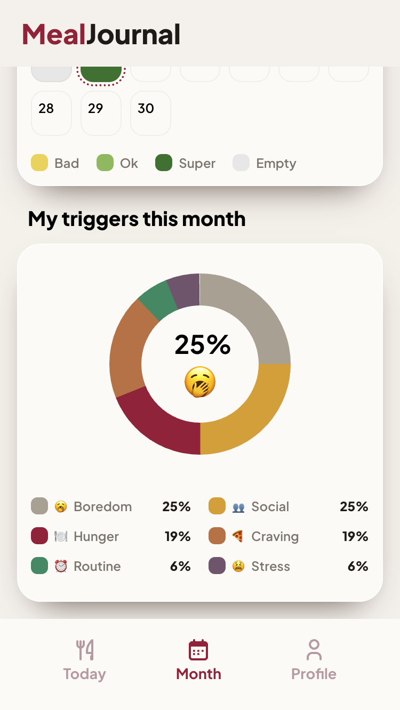

# MealJournal

An offline-first PWA for logging eating patterns — a photo of the meal, the reason you
reached for food, and how you felt about it. It doesn't count calories — it shows patterns
over time: when you eat out of boredom, when you eat your stress, and when it's simply
hunger. It lets you see your own food decisions in a broader perspective.

## Screenshots

<p align="center">
  
  
  
  
  
</p>

## Features

- Log a meal with a photo, a reason ("trigger") and your own rating of the choice
- Edit and delete saved meals
- Day view with a date picker
- Month summary: a day-by-day "satisfaction" heatmap of your decisions + a chart of the most common triggers
- Fully offline: photos and metadata live locally on the user's device

## Stack

- **Client** — React 19, Vite, TypeScript, CSS Modules, Motion
- **Local data** — Dexie (IndexedDB) for metadata, OPFS for photo binaries, Comlink for main thread ↔ Web Worker communication, `vite-plugin-pwa` / Workbox for caching the app shell offline
- **Shared types** — Zod (validation and types shared between client and server)
- **Server** _(early stage)_ — Cloudflare Workers, Hono, Drizzle ORM → D1, R2 for photos (planned only, for now)
- **Tests** — Vitest: unit tests for pure functions + integration tests of the save layer (`MealService`) using dependency injection

## A few architectural decisions

- **Content-addressed storage** — photos are identified by the SHA-256 hash of their
  content rather than a random ID — idempotent write retries for free.
- **Image compression** — Photos are compressed to square WebP thumbnails, since they only serve as a visual reminder of the meal rather than as high-resolution image storage. This keeps upload size and storage costs low without sacrificing the purpose the photo actually serves.
- **Ports and adapters** — `MealRepository`/`PhotoStore` are interfaces;
  `DexieMealRepository` and `OpfsPhotoStore` are the concrete implementations. This lets
  `MealService` be tested with fake, in-memory replacements, without a real database. This
  is how I test the orchestration of saving data offline to IndexedDB and OPFS.
- **OPFS in a Web Worker** — `createSyncAccessHandle` (synchronous, fast file access) only
  works inside a worker; communication with the main thread goes through Comlink to make
  talking to the worker easier.

## Running locally

```bash
npm install
npm run dev:client     # client (Vite)
npm run dev:server     # server (requires a Cloudflare account — see below)
```

```bash
npm run lint
npm run typecheck
npm -w client run test
```

### Cloudflare setup (one-time, only needed for working on `server/`)

```bash
cd server
npx wrangler d1 create mindful-eating-db       # paste the database_id into wrangler.jsonc
npx wrangler r2 bucket create mindful-eating-photos
npx wrangler d1 migrations apply mindful-eating-db --local
```

## Monorepo structure

```
client/            React + Vite + TypeScript, PWA, Dexie (IndexedDB) + OPFS
server/            Cloudflare Workers + Hono, Drizzle ORM -> D1, photos -> R2
packages/shared/   Zod schemas and types shared between client and server
```

## Roadmap

- [x] Save / edit / delete meals with a photo, offline
- [x] Day and month overview (mood heatmap, trigger chart)
- [ ] Full offline support as an installable PWA
- [ ] Login and data sync with the server

Detailed, current backlog: [docs/BACKLOG.md](docs/BACKLOG.md)

## About using AI in this project

I'm building this project mainly for myself and my own personal growth, not to get a
finished app as quickly as possible. That's why I deliberately limit what I use AI for
here — which doesn't mean I don't use it at all, only that the goal is different from
"ship the product as fast as possible".

I really value working with an agent that knows my project's context and has access to the
codebase. For that I use Claude Code with my own CLAUDE.md file, which contains
instructions for the agent that can be summarized like this:

**What AI doesn't do:** it doesn't write my application's logic and doesn't fix bugs for
me in code I wrote myself. When I get stuck, I get hints, not a ready-made solution.

**What AI can do:** configuration and boilerplate (e.g. TypeScript/ESLint settings, project
structure), code review of my code, architecture discussion (naming, patterns, help
understanding different approaches), documentation (including this README) and explaining
concepts I got stuck on.
