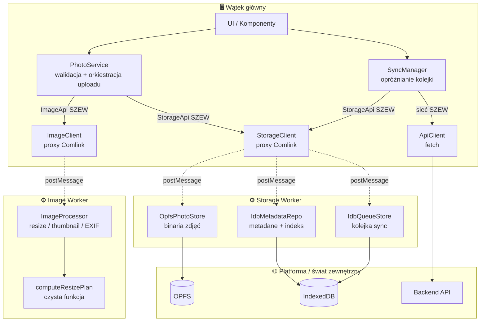

# Plan testowania — PWA offline-first (zdjęcia, OPFS, IndexedDB, workery)

Dokument referencyjny. Łączy architekturę pod testowalność z konkretnym planem testów
warstwa po warstwie. Zasada przewodnia całości:

> **Każda granica w systemie jest jednocześnie granicą testu.**
> Tam, gdzie jedna część przez interfejs woła drugą, w teście podstawiasz atrapę.
> Granice workerów, porty storage i klient sieci to nie tylko decyzje wydajnościowe —
> to szwy, wzdłuż których tniesz system na testowalne kawałki.

---

## 1. Diagram systemu

Elementy i to, kto z kim rozmawia. Linie przerywane (`postMessage`) to granice workerów.
Elementy oznaczone **[SZEW]** to miejsca, które celowo izolujemy w testach (patrz §3).



### Widok tekstowy (gdyby diagram się nie renderował)

```
WĄTEK GŁÓWNY                                  WORKERY
──────────────────────────────               ──────────────────────────────
UI / Komponenty
   ├──> PhotoService ──[ImageApi]────postMessage──> Image Worker
   │         │                                        └─ ImageProcessor
   │         │                                             └─ computeResizePlan (czysta)
   │         └──[StorageApi]──────────postMessage──> Storage Worker
   │                                                  ├─ OpfsPhotoStore ──> OPFS
   └──> SyncManager                                   ├─ IdbMetadataRepo ─> IndexedDB
             ├──[StorageApi]──────────postMessage──>  └─ IdbQueueStore ──> IndexedDB
             └──[sieć]──> ApiClient ──fetch──> Backend API

[ ] w nawiasach = SZWY: interfejsy, które w testach podmieniamy na atrapy.
```

### Przepływ „użytkownik dodaje zdjęcie" przez warstwy

1. UI przekazuje `File` do `PhotoService.upload(file)`.
2. `PhotoService` **waliduje** (czysta funkcja — typ, rozmiar).
3. `PhotoService` woła `ImageApi` → Image Worker robi resize + miniaturę → wracają `Blob`-y.
4. `PhotoService` woła `StorageApi.savePhoto(...)` → Storage Worker zapisuje binarium do OPFS,
   metadane do IDB (kolejność: **najpierw plik, potem indeks**).
5. `PhotoService` dokłada operację do kolejki: `StorageApi.enqueueSync(op)`.
6. `SyncManager` (na zdarzenie `online` / po enqueue) czyta kolejkę przez `StorageApi`,
   wysyła przez `ApiClient`, po sukcesie usuwa operację z kolejki.

---

## 2. Podział kodu pod testowalność

Reguła generalna: **oddziel decyzje (czyste) od efektów (brudne).**
Czyste funkcje testujesz trywialnie w Node; brudne (OPFS, canvas, sieć, worker) izolujesz
za portem albo testujesz osobno w prawdziwej przeglądarce.

```
src/
  shared/
    ports.ts            # WSZYSTKIE kontrakty: StorageApi, QueueStore, ImageApi, Clock, IdGen
    types.ts            # PhotoMeta, SyncOp

  images/
    resize-plan.ts              # CZYSTE (matematyka wymiarów)          → Node
    resize-plan.test.ts
    image-processor.ts          # BRUDNE (createImageBitmap, canvas)    → przeglądarka
    image-processor.browser.test.ts
    image.worker.ts             # Comlink.expose(new ImageProcessor())

  storage/
    opfs-photo-store.ts         # BRUDNE (createSyncAccessHandle)       → przeglądarka + worker
    opfs-photo-store.browser.test.ts
    idb-metadata-repo.ts        # BRUDNE (IndexedDB)                    → Node (fake-indexeddb)
    idb-metadata-repo.test.ts
    idb-queue-store.ts          # BRUDNE (IndexedDB)                    → Node (fake-indexeddb)
    idb-queue-store.test.ts
    storage.worker.ts           # Comlink.expose(new StorageWorkerApi())

  main/
    photo-service.ts            # LOGIKA (orkiestracja)                 → Node (fake StorageApi+ImageApi)
    photo-service.test.ts
    sync-manager.ts             # LOGIKA (opróżnianie kolejki)          → Node (fake QueueStore + MSW)
    sync-manager.test.ts
    storage-client.ts           # Comlink.wrap(Worker) — GLUE, bez testów jednostkowych
    image-client.ts             # GLUE
    api-client.ts               # cienki wrapper fetch

  test/
    setup.ts                    # import 'fake-indexeddb/auto'  (projekt „unit")
    fakes/
      in-memory-storage.ts      # SZEW: atrapa StorageApi
      in-memory-queue.ts        # SZEW: atrapa QueueStore
      fake-image-processor.ts   # SZEW: atrapa ImageApi
      fixed-clock.ts            # SZEW: deterministyczny Clock + IdGen

e2e/
  fixtures/                     # prawdziwe pliki: sample.jpg, orientation-6.jpg, sample.heic
  photos.spec.ts
  offline.spec.ts

vitest.config.ts                # projekty: „unit" (node) + „browser" (chromium)
playwright.config.ts            # webServer serwujący BUILD (nie dev!)
```

### Kontrakty (`shared/ports.ts`) — pełna lista szwów jako kod

```typescript
export interface PhotoMeta {
  id: string;
  type: string;
  size: number;
  width: number;
  height: number;
  createdAt: number;
}

export interface SyncOp {
  id: string;             // klucz idempotencji
  photoId: string;
  kind: 'upload' | 'delete';
  attempts: number;
}

// Granica main <-> Storage Worker
export interface StorageApi {
  savePhoto(id: string, blob: Blob, thumb: Blob, meta: PhotoMeta): Promise<void>;
  loadPhoto(id: string): Promise<Blob>;
  listPhotos(): Promise<PhotoMeta[]>;
  deletePhoto(id: string): Promise<void>;
  enqueueSync(op: SyncOp): Promise<void>;
  pendingSync(): Promise<SyncOp[]>;
  resolveSync(id: string): Promise<void>;
}

// Granica SyncQueue <-> IndexedDB (węższy port dla samej kolejki)
export interface QueueStore {
  add(op: SyncOp): Promise<void>;
  all(): Promise<SyncOp[]>;
  update(op: SyncOp): Promise<void>;
  remove(id: string): Promise<void>;
}

// Granica main <-> Image Worker
export interface ImageApi {
  process(file: File, maxEdge: number, thumbSize: number):
    Promise<{ full: Blob; thumb: Blob; width: number; height: number }>;
}

// Determinizm w testach
export type Clock = () => number;        // zamiast Date.now()
export type IdGen = () => string;        // zamiast crypto.randomUUID()
```

Zasada: **to, co chcesz podmieniać w teście, przyjmuj przez konstruktor/argument.**
`PhotoService` i `SyncManager` nie tworzą swoich zależności — dostają je z zewnątrz.

```typescript
// main/photo-service.ts — wszystko wstrzyknięte, zero "new Worker" w środku
export class PhotoService {
  constructor(
    private storage: StorageApi,
    private images: ImageApi,
    private now: Clock,
    private newId: IdGen,
  ) {}
  // ...
}
```

W produkcji składasz to raz, w jednym miejscu (composition root):

```typescript
// main/bootstrap.ts
export const service = new PhotoService(
  storageClient,          // Comlink.wrap(Worker)
  imageClient,            // Comlink.wrap(Worker)
  () => Date.now(),
  () => crypto.randomUUID(),
);
```

W teście składasz to samo z atrap — ten sam kod `PhotoService`, inne zależności.

---

## 3. Katalog szwów — co i po co izolujemy

Serce planu. Każdy szew to interfejs, który w testach podmieniasz, żeby odciąć się od
czegoś wolnego, niedeterministycznego albo niedostępnego w danym środowisku.

| # | Szew (interfejs)     | Prawdziwa implementacja        | W teście podstawiamy            | Dzięki temu testujemy…                          |
|---|----------------------|--------------------------------|---------------------------------|-------------------------------------------------|
| 1 | `StorageApi`         | Comlink → Storage Worker       | `createInMemoryStorage()` (fake)| logikę `PhotoService` / UI bez workera i OPFS   |
| 2 | `QueueStore`         | `IdbQueueStore` (IDB)          | `createInMemoryQueue()` (Map)   | logikę kolejki sync bez IndexedDB               |
| 3 | `ImageApi`           | Comlink → Image Worker         | `fakeImageProcessor` (zwraca kanapkę Blobów) | `PhotoService` bez dekodowania obrazów |
| 4 | sieć (`ApiClient`)   | `fetch` → backend              | **MSW** (`setupServer`)         | sync: sukces / offline / 500 / 409 / retry      |
| 5 | `Clock`              | `Date.now`                     | `() => 1000` (stały)            | deterministyczne `createdAt` w asercjach        |
| 6 | `IdGen`              | `crypto.randomUUID`            | `() => 'id_1'` (licznik)        | przewidywalne `id`, `toEqual` na całym obiekcie |
| 7 | granica workera      | `new Worker(...)` + Comlink    | **pomijamy** — testujemy klasę wprost | `OpfsPhotoStore`/repo bez proxy (w przeglądarce) |

Dwie ważne uwagi do tabeli:

- **Szew #4 to nie ręczna atrapa, tylko MSW.** Sieci nie fake'ujemy przez podmianę obiektu —
  przechwytujemy ją na poziomie sieci, żeby testować prawdziwy `fetch` z prawdziwymi kodami HTTP.
- **`navigator.onLine` NIE jest szwem — projektujemy go poza systemem.** Nie bramkuj sync
  przez `if (navigator.onLine)`; źródłem prawdy jest wynik `fetch`. Dzięki temu nie musisz go
  mockować, a MSW steruje całą „rzeczywistością sieciową".

### Atrapy (`test/fakes/`)

```typescript
// in-memory-storage.ts — fake StorageApi (szew #1)
export function createInMemoryStorage(): StorageApi {
  const blobs = new Map<string, Blob>();
  const metas = new Map<string, PhotoMeta>();
  const queue = new Map<string, SyncOp>();
  return {
    async savePhoto(id, blob, _thumb, meta) { blobs.set(id, blob); metas.set(id, meta); },
    async loadPhoto(id) { const b = blobs.get(id); if (!b) throw new Error('not-found'); return b; },
    async listPhotos() { return [...metas.values()]; },
    async deletePhoto(id) { blobs.delete(id); metas.delete(id); },
    async enqueueSync(op) { queue.set(op.id, op); },
    async pendingSync() { return [...queue.values()]; },
    async resolveSync(id) { queue.delete(id); },
  };
}

// fake-image-processor.ts — fake ImageApi (szew #3), NIE dotyka canvasu
export const fakeImageProcessor: ImageApi = {
  async process() {
    return {
      full: new Blob(['full'], { type: 'image/jpeg' }),
      thumb: new Blob(['thumb'], { type: 'image/jpeg' }),
      width: 1000, height: 667,
    };
  },
};

// fixed-clock.ts — determinizm (szwy #5, #6)
export const fixedClock: Clock = () => 1000;
export function seqIdGen(): IdGen { let n = 0; return () => `id_${++n}`; }
```

---

## 4. Macierz testów — co, czym, gdzie

| Warstwa / element        | Rodzaj testu   | Narzędzie                    | Gdzie działa       | Co izoluje (szwy)          |
|--------------------------|----------------|------------------------------|--------------------|----------------------------|
| `validatePhoto`          | jednostkowy    | Vitest                       | Node               | nic (czyste)               |
| `computeResizePlan`      | jednostkowy    | Vitest                       | Node               | nic (czyste)               |
| `PhotoService`           | jednostkowy    | Vitest + fake/spy            | Node               | #1, #3, #5, #6             |
| `SyncManager` / kolejka  | jednostkowy    | Vitest + **MSW**             | Node               | #2, #4                     |
| `IdbMetadataRepo`        | integracyjny   | Vitest + **fake-indexeddb**  | Node               | #7 (bez workera)           |
| `IdbQueueStore`          | integracyjny   | Vitest + fake-indexeddb      | Node               | #7                         |
| `OpfsPhotoStore`         | integracyjny   | **Vitest Browser Mode**      | Chromium + worker  | #7 (test przez mini-worker)|
| `ImageProcessor`         | integracyjny   | Vitest Browser Mode          | Chromium           | — (prawdziwy canvas)       |
| pełne przepływy          | E2E            | **Playwright**               | Chromium + build   | nic — wszystko prawdziwe   |
| offline / service worker | E2E            | Playwright (`setOffline`)    | Chromium + build   | nic                        |

Proporcja (piramida): **najwięcej jednostkowych, solidna warstwa integracyjnych na realnych
API storage, cienka warstwa E2E (6–8 scenariuszy).**

### Które przypadki gdzie

- **Kombinatorykę i błędy** (rozmiary, walidacje, retry, konflikty, semantyka IDB) → jednostkowe/integracyjne.
- **Realne API platformy** (czy `createSyncAccessHandle` naprawdę zapisuje bajty, czy kursor
  IDB sortuje) → integracyjne.
- **Montaż całości** (upload → reload → offline → sync) → E2E, tylko happy paths i krytyczne ścieżki.

Test różniący się od innego **tylko danymi wejściowymi** = jednostkowy.
Test sprawdzający, że **kawałki się spinają** = E2E.

---

## 5. Pliki konfiguracyjne (komplet)

```typescript
// vitest.config.ts — dwa światy: szybki Node i wolna przeglądarka
import { defineConfig } from 'vitest/config';
import { playwright } from '@vitest/browser-playwright';

export default defineConfig({
  test: {
    clearMocks: true,        // zeruj historię szpiegów między testami
    restoreMocks: true,      // przywracaj oryginały po spyOn
    projects: [
      {
        test: {
          name: 'unit',
          include: ['src/**/*.test.ts'],
          exclude: ['src/**/*.browser.test.ts'],
          setupFiles: ['./test/setup.ts'],     // fake-indexeddb/auto
        },
      },
      {
        test: {
          name: 'browser',
          include: ['src/**/*.browser.test.ts'],
          browser: {
            enabled: true,
            provider: playwright(),
            headless: true,
            instances: [{ browser: 'chromium' }],
          },
        },
      },
    ],
  },
});
```

```typescript
// test/setup.ts
import 'fake-indexeddb/auto';   // podstawia globalne indexedDB w projekcie „unit"
```

```typescript
// playwright.config.ts
import { defineConfig, devices } from '@playwright/test';

export default defineConfig({
  testDir: './e2e',
  webServer: {
    command: 'npm run build && npm run preview',   // BUILD — SW nie działa w dev
    url: 'http://localhost:4173',
    reuseExistingServer: !process.env.CI,
    timeout: 120_000,
  },
  use: { baseURL: 'http://localhost:4173', trace: 'on-first-retry' },
  retries: process.env.CI ? 2 : 0,
  projects: [{ name: 'chromium', use: { ...devices['Desktop Chrome'] } }],
});
```

```jsonc
// package.json (fragment)
{
  "scripts": {
    "test": "vitest",
    "test:unit": "vitest --project unit",
    "test:browser": "vitest --project browser",
    "test:e2e": "playwright test",
    "test:all": "vitest run && playwright test",
    "coverage": "vitest run --coverage"
  }
}
```

---

## 6. Kolejność budowy (implementuj i testuj razem)

Buduj od kontraktów w górę. Każdy krok = kod + jego testy, zanim ruszysz dalej.

1. `shared/ports.ts` + `shared/types.ts` — kontrakty najpierw (nic do testowania, ale wszystko się o nie opiera).
2. `validatePhoto` + testy jednostkowe (matchery).
3. `computeResizePlan` + testy jednostkowe (liczby, `toBeCloseTo`).
4. `IdbMetadataRepo` + testy z `fake-indexeddb` (pamiętaj `new IDBFactory()` w `beforeEach`).
5. `IdbQueueStore` + testy z `fake-indexeddb`.
6. Atrapy w `test/fakes/` — infrastruktura testowa dla warstwy logiki.
7. `PhotoService` + testy na atrapach (fake StorageApi/ImageApi, spy na `not.toHaveBeenCalled` przy złym pliku).
8. `SyncQueue`/`SyncManager` + testy z MSW (offline, 500+retry, 409, idempotency-key).
9. `OpfsPhotoStore` + testy w Browser Mode przez mini-worker (round-trip Blob, `afterEach` czyści OPFS).
10. `ImageProcessor` + testy w Browser Mode (prawdziwe piksele przez `makeImage`, uszkodzony plik odrzucony).
11. Workery (`Comlink.expose`) + klienci (`Comlink.wrap`) — glue, weryfikowane dopiero na E2E.
12. E2E: happy path (upload → reload) + offline (SW serwuje, dane trwają) + sync (offline→online).
13. CI + coverage (§7).

---

## 7. Coverage i CI

### Coverage — narzędzie, nie cel

```bash
npm i -D @vitest/coverage-v8
```

Włącz progi, ale **celuj w warstwy logiki, nie w glue**. 100% globalnie to pułapka: zmusza do
testowania trywialnych getterów i warstwy Comlink, której i tak nie testujesz jednostkowo.

```typescript
// w vitest.config.ts -> test:
coverage: {
  provider: 'v8',
  include: ['src/**/*.ts'],
  exclude: ['src/**/*.worker.ts', 'src/main/*-client.ts', 'src/**/*.test.ts'],
  thresholds: {
    // wysokie progi tam, gdzie mieszka logika:
    'src/main/**': { statements: 90, branches: 85 },
    'src/images/resize-plan.ts': { statements: 100 },
  },
},
```

Traktuj coverage jak wykrywacz **nieprzetestowanych gałęzi**, nie jak wynik do maksowania.
Brakująca gałąź w `SyncManager` to sygnał; brakująca linijka w `storage-client.ts` — nieistotna.

### CI (GitHub Actions) — dwa etapy: szybki i wolny

```yaml
# .github/workflows/test.yml
name: test
on: [push, pull_request]
jobs:
  unit:                              # szybki feedback: Node, sekundy
    runs-on: ubuntu-latest
    steps:
      - uses: actions/checkout@v4
      - uses: actions/setup-node@v4
        with: { node-version: 22, cache: npm }
      - run: npm ci
      - run: npm run test:unit -- --run
      - run: npm run coverage -- --run

  browser-e2e:                       # wolny: prawdziwy Chromium
    runs-on: ubuntu-latest
    steps:
      - uses: actions/checkout@v4
      - uses: actions/setup-node@v4
        with: { node-version: 22, cache: npm }
      - run: npm ci
      - run: npx playwright install --with-deps chromium
      - run: npm run test:browser -- --run
      - run: npm run test:e2e
      - uses: actions/upload-artifact@v4     # zapisz raport przy porażce
        if: failure()
        with: { name: playwright-report, path: playwright-report/ }
```

Rozdzielenie na dwa joby daje szybki sygnał z testów jednostkowych, nawet gdy wolne
browser/E2E jeszcze się kręcą.

---

## 8. Antywzorce — czego pilnować

- **Zapomniany `await`** w teście async → fałszywa zieloność. Dotykasz `Promise` → `async` + `await`,
  a błędy przez `await expect(...).rejects.toThrow()`.
- **Brak izolacji storage.** IDB: `new IDBFactory()` w `beforeEach`. OPFS: rekurencyjne czyszczenie
  w `afterEach`. Oba są **trwałe** i przeciekają między testami (OPFS nawet między testami w jednym pliku).
- **`createSyncAccessHandle` na wątku głównym** → błąd. To API tylko w workerze; testuj `OpfsPhotoStore`
  przez mini-worker w Browser Mode.
- **Fake udający OPFS/IDB zamiast testu integracyjnego.** Fake `StorageApi` służy do testów *logiki nad
  storage*, nie do udawania platformy. Realne API testuj na `fake-indexeddb` (Node) i w przeglądarce (OPFS).
- **`page.waitForTimeout(n)` w E2E** → flaky i wolne. Używaj asercji web-first i czekaj na kontroler SW.
- **Testowanie dokładnych bajtów/pikseli obrazu** → flaky (enkodery się różnią). Sprawdzaj właściwości:
  wymiary, typ, „mniejszy niż oryginał", „daje się zdekodować".
- **Bramkowanie sync przez `navigator.onLine`.** Źródłem prawdy jest wynik `fetch`.
- **Nadmiar mocków.** Zaczynaj od fake'a (stan); spy tylko gdy sprawdzasz sam fakt/kształt wywołania.

---

## 9. Ściąga jednym zdaniem na warstwę

- **Czyste funkcje** (`validate`, `resizePlan`): Vitest, Node, zero atrap.
- **Logika** (`PhotoService`, `SyncManager`): Vitest, Node, atrapy przez DI + MSW dla sieci.
- **Repo IDB**: Vitest + `fake-indexeddb`, Node — realna semantyka bazy.
- **Store OPFS**: Vitest Browser Mode, Chromium + mini-worker — realny system plików.
- **Obróbka zdjęć**: Vitest Browser Mode, Chromium — realne piksele.
- **Całość**: Playwright na buildzie — prawdziwy SW, `setOffline`, prawdziwe dane.
